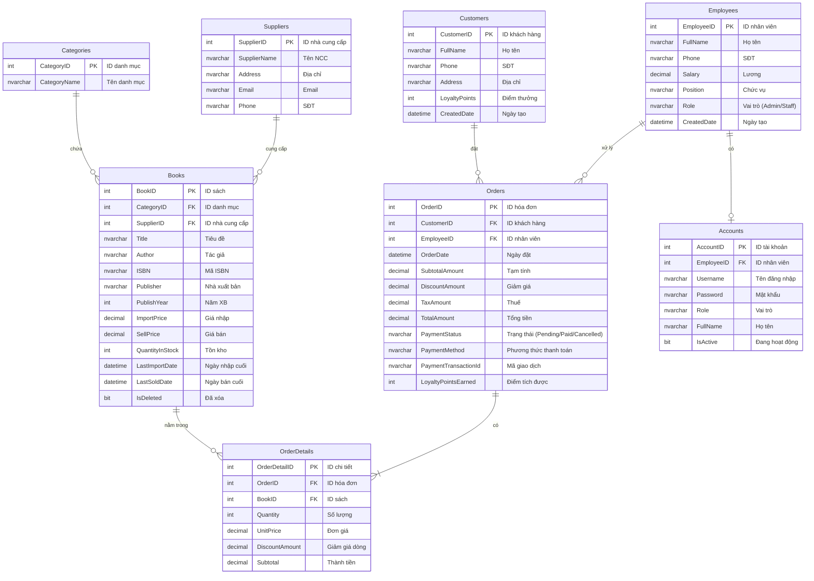

# Sơ đồ ERD - BookStore Management System

## ERD Diagram (Mermaid)

## Mô tả mối quan hệ

| Quan hệ | Cardinality | Diễn giải |
|---------|-------------|-----------|
| Categories → Books | 1:N | Một danh mục có nhiều sách |
| Suppliers → Books | 1:N | Một nhà cung cấp cung cấp nhiều sách |
| Books → OrderDetails | 1:N | Một sách có thể xuất hiện trong nhiều chi tiết hóa đơn |
| Orders → OrderDetails | 1:N | Một hóa đơn có nhiều dòng chi tiết |
| Customers → Orders | 1:N | Một khách hàng có thể đặt nhiều hóa đơn |
| Employees → Orders | 1:N | Một nhân viên xử lý nhiều hóa đơn |
| Employees → Accounts | 1:0..1 | Một nhân viên có thể có một tài khoản đăng nhập |
