# Sơ đồ lớp (Class Diagram) - BookStore Management System

```mermaid
classDiagram
    direction TB

    %% ==================== DTO ====================
    namespace DTO {
        class Book {
            +int BookID
            +int CategoryID
            +int SupplierID
            +string Title
            +string Author
            +string ISBN
            +string Publisher
            +int PublishYear
            +decimal ImportPrice
            +decimal SellPrice
            +int QuantityInStock
            +DateTime? LastImportDate
            +DateTime? LastSoldDate
            +bool IsDeleted
        }

        class Customer {
            +int CustomerID
            +string FullName
            +string Phone
            +string Address
            +int LoyaltyPoints
            +DateTime CreatedDate
        }

        class Employee {
            +int EmployeeID
            +string FullName
            +string Phone
            +decimal Salary
            +string Position
            +string Role
            +DateTime CreatedDate
        }

        class Order {
            +int OrderID
            +int CustomerID
            +int EmployeeID
            +DateTime OrderDate
            +decimal SubtotalAmount
            +decimal DiscountAmount
            +decimal TaxAmount
            +decimal TotalAmount
            +string PaymentStatus
            +string PaymentMethod
            +string PaymentTransactionId
            +int LoyaltyPointsEarned
        }

        class OrderDetail {
            +int OrderDetailID
            +int OrderID
            +int BookID
            +int Quantity
            +decimal UnitPrice
            +decimal DiscountAmount
            +decimal Subtotal
        }

        class Category {
            +int CategoryID
            +string CategoryName
        }

        class Supplier {
            +int SupplierID
            +string SupplierName
            +string Address
            +string Email
            +string Phone
        }

        class Account {
            +int AccountID
            +int EmployeeID
            +string Username
            +string Password
            +string Role
            +string FullName
            +bool IsActive
        }

        class CartLine {
            +int BookID
            +string BookTitle
            +int Quantity
            +decimal UnitPrice
            +decimal DiscountAmount
            +decimal Subtotal
        }

        class CheckoutRequest {
            +int CustomerID
            +int EmployeeID
            +string PaymentStatus
            +string PaymentMethod
            +DiscountType OrderDiscountType
            +decimal OrderDiscountValue
            +decimal TaxRate
            +int LoyaltyPointsToRedeem
            +List~CartLine~ Lines
        }

        class ValidationResult {
            +bool IsValid
            +string ErrorMessage
            +Success()$
            +Failure(string)$
        }
    }

    %% ==================== DAL ====================
    namespace DAL {
        class DbConnectionFactory {
            +Create() SqlConnection$
        }

        class IBookRepository {
            <<interface>>
            +GetAll() List~Book~
            +GetById(int) Book?
            +Add(Book)
            +Update(Book)
            +Delete(int)
            +UpdateStock(int, int, DateTime?)
        }

        class BookRepository {
            +GetAll() List~Book~
            +GetById(int) Book?
            +Add(Book)
            +Update(Book)
            +Delete(int)
            +UpdateStock(int, int, DateTime?)
        }

        class IOrderRepository {
            <<interface>>
            +GetAll() List~OrderViewDto~
            +GetByDateRange(DateTime?, DateTime?) List~OrderViewDto~
            +GetOrder(int) Order?
            +GetDetails(int) List~OrderDetailViewDto~
            +CreateOrder(Order, List~OrderDetail~)
        }

        class OrderRepository {
            +GetAll() List~OrderViewDto~
            +GetByDateRange(DateTime?, DateTime?) List~OrderViewDto~
            +GetOrder(int) Order?
            +GetDetails(int) List~OrderDetailViewDto~
            +CreateOrder(Order, List~OrderDetail~)
        }

        class ICustomerRepository {
            <<interface>>
            +GetAll() List~Customer~
            +GetById(int) Customer?
            +Add(Customer)
            +Update(Customer)
            +Delete(int)
        }

        class CustomerRepository {
            +GetAll() List~Customer~
            +GetById(int) Customer?
            +Add(Customer)
            +Update(Customer)
            +Delete(int)
        }

        class IAccountRepository {
            <<interface>>
            +GetByUsername(string) Account?
        }

        class AccountRepository {
            +GetByUsername(string) Account?
        }
    }

    %% ==================== BLL ====================
    namespace BLL {
        class IBookService {
            <<interface>>
            +GetBooks() List~Book~
            +GetBook(int) Book?
            +AddBook(Book) ValidationResult
            +UpdateBook(Book) ValidationResult
            +DeleteBook(int) ValidationResult
            +GetFilteredBookViews(BookFilter) List~BookViewDto~
            +GetPublishers() List~string~
        }

        class BookService {
            -IBookRepository _repo
            -ICategoryRepository _categoryRepo
            +GetBooks() List~Book~
            +GetBook(int) Book?
            +AddBook(Book) ValidationResult
            +UpdateBook(Book) ValidationResult
            +DeleteBook(int) ValidationResult
        }

        class IPosService {
            <<interface>>
            +AddOrUpdateLine(...) ValidationResult
            +CalculateTotals(...) CartTotals
            +PrepareCheckout(CheckoutRequest) CheckoutResult
            +CompleteCheckout(CheckoutResult) ValidationResult
        }

        class PosService {
            -IBookRepository _bookRepo
            -ICustomerRepository _customerRepo
            -IOrderRepository _orderRepo
            +AddOrUpdateLine(...) ValidationResult
            +CalculateTotals(...) CartTotals
            +PrepareCheckout(CheckoutRequest) CheckoutResult
            +CompleteCheckout(CheckoutResult) ValidationResult
        }

        class IAuthService {
            <<interface>>
            +Login(string, string) Account?
        }

        class AuthService {
            -IAccountRepository _repo
            +Login(string, string) Account?
        }

        class IPaymentProvider {
            <<interface>>
            +CreatePaymentAsync(...) PaymentCreationResult
            +QueryStatusAsync(...) PaymentStatusResult
        }

        class DemoPaymentProvider {
            +CreatePaymentAsync(...) PaymentCreationResult
            +QueryStatusAsync(...) PaymentStatusResult
        }

        class MomoPaymentProvider {
            -MomoConfig _config
            -HttpClient _httpClient
            +CreatePaymentAsync(...) PaymentCreationResult
            +QueryStatusAsync(...) PaymentStatusResult
        }

        class VNPayPaymentProvider {
            -VNPayConfig _config
            -HttpClient _httpClient
            +CreatePaymentAsync(...) PaymentCreationResult
            +QueryStatusAsync(...) PaymentStatusResult
        }

        class PaymentProviderFactory {
            +Create(PaymentConfig) IPaymentProvider$
        }
    }

    %% ==================== UI ====================
    namespace UI {
        class ServiceLocator {
            <<static>>
            +BookService IBookService
            +CategoryService ICategoryService
            +CustomerService ICustomerService
            +EmployeeService IEmployeeService
            +OrderService IOrderService
            +PosService IPosService
            +ReportService IReportService
            +SupplierService ISupplierService
            +AuthService IAuthService
            +DashboardService IDashboardService
        }

        class PosForm {
            -IBookService _bookService
            -ICustomerService _customerService
            -IEmployeeService _employeeService
            -IPosService _posService
            -List~CartLine~ _lines
            +btnAddLine_Click()
            +btnSave_Click()
            +btnPayWithQr_Click()
        }

        class OrderCreateForm {
            -IOrderService _orderService
            -IBookService _bookService
            -ICustomerService _customerService
            -IEmployeeService _employeeService
            -List~OrderDetail~ _lines
            +btnAddLine_Click()
            +btnSave_Click()
        }

        class BookEditForm {
            -ICategoryService _categoryService
            -ISupplierService _supplierService
            +Book Book
            +btnSave_Click()
        }

        class MainForm {
            -string _role
            +LoadControl(UserControl)
        }
    }

    %% ==================== UTILITIES ====================
    namespace Utilities {
        class FileLogger {
            +Info(string)$
            +Error(string, Exception?)$
        }

        class ReportExporter {
            +ExportToCsv(ReportSectionDto, string)$
            +ExportToExcel(ReportSectionDto, string)$
            +ExportToPdf(ReportSectionDto, string)$
        }
    }

    %% ==================== RELATIONSHIPS ====================

    %% DAL
    IBookRepository <|.. BookRepository : implements
    IOrderRepository <|.. OrderRepository : implements
    ICustomerRepository <|.. CustomerRepository : implements
    IAccountRepository <|.. AccountRepository : implements

    BookRepository --> DbConnectionFactory : uses
    OrderRepository --> DbConnectionFactory : uses
    CustomerRepository --> DbConnectionFactory : uses
    AccountRepository --> DbConnectionFactory : uses

    BookRepository ..> Book : returns
    OrderRepository ..> Order : returns
    OrderRepository ..> OrderDetail : uses
    CustomerRepository ..> Customer : returns
    AccountRepository ..> Account : returns

    %% BLL
    IBookService <|.. BookService : implements
    IPosService <|.. PosService : implements
    IAuthService <|.. AuthService : implements
    IPaymentProvider <|.. DemoPaymentProvider : implements
    IPaymentProvider <|.. MomoPaymentProvider : implements
    IPaymentProvider <|.. VNPayPaymentProvider : implements

    BookService --> IBookRepository : injects
    BookService --> ICategoryRepository : injects
    PosService --> IBookRepository : injects
    PosService --> ICustomerRepository : injects
    PosService --> IOrderRepository : injects
    AuthService --> IAccountRepository : injects

    PaymentProviderFactory ..> DemoPaymentProvider : creates
    PaymentProviderFactory ..> MomoPaymentProvider : creates
    PaymentProviderFactory ..> VNPayPaymentProvider : creates

    %% UI
    ServiceLocator --> IBookService : wires
    ServiceLocator --> IPosService : wires
    ServiceLocator --> IAuthService : wires
    ServiceLocator --> ICustomerService : wires
    ServiceLocator --> IEmployeeService : wires
    ServiceLocator --> IOrderService : wires

    PosForm --> ServiceLocator : uses
    PosForm --> IBookService : uses
    PosForm --> ICustomerService : uses
    PosForm --> IEmployeeService : uses
    PosForm --> IPosService : uses
    PosForm ..> CartLine : uses
    PosForm ..> CheckoutRequest : uses

    OrderCreateForm --> ServiceLocator : uses
    OrderCreateForm --> IOrderService : uses
    OrderCreateForm ..> OrderDetail : uses

    BookEditForm --> ServiceLocator : uses
    BookEditForm --> ICategoryService : uses
    BookEditForm --> ISupplierService : uses
    BookEditForm ..> Book : edits

    MainForm --> ServiceLocator : uses
```



## Mô tả kiến trúc phân lớp

```
┌─────────────────────────────────────────────┐
│  UI Layer (Forms, UserControls)              │
│  ServiceLocator ──► BLL Interfaces           │
├─────────────────────────────────────────────┤
│  BLL Layer (Services)                        │
│  Business logic + Validation                 │
│  ──► DAL Interfaces (constructor injection)  │
├─────────────────────────────────────────────┤
│  DAL Layer (Repositories)                    │
│  ADO.NET ──► SQL Server                      │
│  ──► DbConnectionFactory                     │
├─────────────────────────────────────────────┤
│  DTO Layer (Entities, Enums, DTOs)           │
│  Shared across all layers                    │
├─────────────────────────────────────────────┤
│  Utilities (FileLogger, ReportExporter)      │
└─────────────────────────────────────────────┘
```

## Giải thích quan hệ

| Ký hiệu Mermaid | Ý nghĩa |
|-----------------|---------|
| `..>` | Dependency (sử dụng) |
| `-->` | Association (tham chiếu) |
| `<|--` | Realization/Implementation (interface → class) |
| `o--` | Aggregation |
