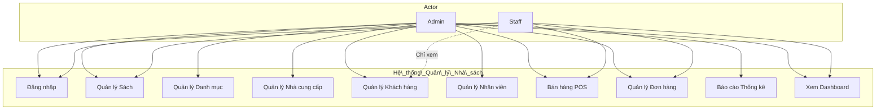

# BÁO CÁO ĐỒ ÁN: THIẾT KẾ VÀ PHÁT TRIỂN PHẦN MỀM QUẢN LÝ NHÀ SÁCH

## BookStore Management System

---

## MỤC LỤC

1. [Giới thiệu chung](#1-giới-thiệu-chung)
2. [Phân tích hệ thống](#2-phân-tích-hệ-thống)
3. [Thiết kế hệ thống](#3-thiết-kế-hệ-thống)
4. [Triển khai hệ thống](#4-triển-khai-hệ-thống)
5. [Kết quả và thảo luận](#5-kết-quả-và-thảo-luận)
6. [Kết luận và Hướng phát triển](#6-kết-luận-và-hướng-phát-triển)

---

## 1. Giới thiệu chung

### 1.1. Tổng quan đề tài

Trong bối cảnh chuyển đổi số mạnh mẽ, việc ứng dụng công nghệ thông tin vào công tác quản lý bán lẻ nói chung và quản lý nhà sách nói riêng là xu thế tất yếu nhằm nâng cao hiệu quả vận hành và tối ưu hóa trải nghiệm khách hàng. Đề tài này đề xuất một hệ thống phần mềm quản lý nhà sách có khả năng tự động hóa các nghiệp vụ như quản lý kho sách, bán hàng tại quầy (POS), quản lý khách hàng, quản lý nhân sự và thống kê báo cáo. Hệ thống được thiết kế với giao diện thân thiện, phù hợp với các nhà sách có quy mô vừa và nhỏ tại các đô thị.

### 1.2. Mục tiêu và phạm vi đề tài

**Mục tiêu chính.** Xây dựng một phần mềm quản lý nhà sách có giao diện thân thiện, dễ sử dụng và tích hợp đầy đủ các chức năng như cập nhật dữ liệu sách và ngườ dùng, xử lý bán hàng POS, truy vấn dữ liệu linh hoạt và xuất báo cáo thống kê hỗ trợ công tác quản lý.

**Phạm vi.** Hệ thống được thiết kế dành riêng cho các nhà sách quy mô vừa và nhỏ. Phạm vi triển khai giới hạn trong các chức năng cơ bản, chưa bao gồm các tính năng mở rộng như thương mại điện tử hoặc đồng bộ đa chi nhánh. Mục tiêu là tạo ra một công cụ có tính ứng dụng cao, đáp ứng đúng và đủ các yêu cầu thiết yếu trong quản lý nhà sách truyền thống.

### 1.3. Các công nghệ sử dụng

Trong quá trình phân tích, thiết kế và triển khai hệ thống, đề tài áp dụng phương pháp phát triển hướng đối tượng (OOAD), kết hợp mô hình hóa bằng sơ đồ UML để biểu diễn cấu trúc và hành vi của phần mềm. Quá trình lập trình được thực hiện bằng ngôn ngữ C# trên nền tảng .NET 9 Windows Forms (WinForms), cung cấp giao diện đồ họa trực quan và dễ sử dụng.

Hệ thống sử dụng hệ quản trị cơ sở dữ liệu Microsoft SQL Server để lưu trữ và truy xuất dữ liệu. Kiến trúc phần mềm được tổ chức theo mô hình bốn lớp bao gồm: giao diện ngườ dùng (Presentation Layer), lớp điều phối nghiệp vụ (Business Logic Layer), lớp truy cập dữ liệu (Data Access Layer) và lớp hạ tầng kỹ thuật (Infrastructure Layer). Cấu trúc này giúp tách biệt rõ ràng trách nhiệm của từng thành phần, tăng tính linh hoạt trong phát triển và khả năng mở rộng hệ thống trong tương lai.

Các thư viện bổ sung:
- **Microsoft.Data.SqlClient 5.2.2**: Kết nối ADO.NET với SQL Server.
- **OxyPlot.WindowsForms 2.2.0**: Vẽ biểu đồ báo cáo.
- **Microsoft.Extensions.Configuration.Json**: Đọc file cấu hình `appsettings.json`.

### 1.4. Phương pháp nghiên cứu

Đề tài sử dụng phương pháp nghiên cứu ứng dụng, kết hợp giữa phân tích lý thuyết và thực hành triển khai nhằm xây dựng một hệ thống phần mềm hoàn chỉnh, phù hợp với yêu cầu thực tế của nghiệp vụ quản lý nhà sách. Quá trình phát triển hệ thống tuân theo mô hình phát triển tuần tự (Waterfall), với các giai đoạn chính như phân tích yêu cầu, mô hình hóa bằng UML, thiết kế kiến trúc hệ thống, cài đặt chức năng và kiểm thử.

Phương pháp phân tích và thiết kế hướng đối tượng (OOAD) được sử dụng để đảm bảo tính tái sử dụng và mở rộng của hệ thống. Các sơ đồ UML như Use Case Diagram, Class Diagram, Activity Diagram và Deployment Diagram giúp mô tả rõ ràng các khía cạnh chức năng, cấu trúc và vận hành của hệ thống. Ngoài ra, kỹ thuật kiểm thử hộp trắng và hộp đen được áp dụng trong giai đoạn kiểm thử nhằm đảm bảo chất lượng và ổn định của phần mềm trước khi triển khai.

---

## 2. Phân tích hệ thống

### 2.1. Các chức năng chính của hệ thống

Hệ thống quản lý nhà sách bao gồm các chức năng nghiệp vụ cốt lõi nhằm phục vụ quá trình quản lý sách, khách hàng, nhân viên, bán hàng và thống kê báo cáo. Giao diện trang chủ thể hiện các nhóm chức năng chính như sau.

**Chức năng quản lý sách** bao gồm các nghiệp vụ thêm, sửa, xóa và tìm kiếm sách theo mã sách, tên sách hoặc các tiêu chí liên quan như tác giả, nhà xuất bản và thể loại. Ngoài ra, hệ thống còn hỗ trợ quản lý phân loại sách, nhà cung cấp, với mỗi phần đều cho phép thực hiện các thao tác CRUD tương tự.

**Quản lý khách hàng** tập trung vào việc lưu trữ thông tin khách hàng, tra cứu nhanh theo tên hoặc số điện thoại, đồng thờ hỗ trợ cập nhật, thêm mới hoặc xóa thông tin khách hàng. Hệ thống tích hợp chương trình tích điểm thưởng (Loyalty Points) để khuyến khích khách hàng quay lại mua sắm.

**Chức năng bán hàng POS** bao gồm tạo giỏ hàng, áp dụng giảm giá từng dòng và giảm giá đơn hàng, tính thuế, đổi điểm tích lũy và thanh toán đa dạng (tiền mặt / QR). Hệ thống tự động kiểm tra tồn kho và cập nhật số lượng sách sau mỗi giao dịch.

**Quản lý đơn hàng** cho phép xem danh sách đơn hàng, chi tiết từng đơn, lọc theo khoảng thờ gian và trạng thái thanh toán. Nhân viên có thể cập nhật trạng thái đơn hàng theo quy tắc nghiệp vụ.

**Quản lý nhân viên** hỗ trợ thêm, sửa, xóa thông tin nhân viên và phân quyền theo vai trò Admin/Staff.

**Thống kê - Báo cáo** cung cấp các chỉ số thống kê về doanh thu, sách bán chạy, tồn kho và xuất báo cáo đa định dạng (CSV, Excel, PDF).

Cuối cùng, **hệ thống xác thực ngườ dùng** đảm bảo chỉ những ngườ có quyền mới truy cập được vào chức năng quản lý, với hai vai trò chính là Admin (toàn quyền) và Staff (bán hàng + xem sách).

### 2.2. Đặc tả yêu cầu

#### 2.2.1. Yêu cầu chức năng

Hệ thống cần hỗ trợ đầy đủ các chức năng cơ bản bao gồm: đăng nhập và xác thực ngườ dùng với phân quyền Admin/Staff; quản lý sách với các thao tác thêm, sửa, xóa, tìm kiếm theo nhiều tiêu chí như mã sách, tên sách, tác giả, thể loại và nhà cung cấp; quản lý khách hàng với chức năng thêm mới, chỉnh sửa thông tin hoặc xóa khách hàng; hỗ trợ nghiệp vụ bán hàng POS bao gồm tạo giỏ hàng, áp dụng giảm giá, tính thuế, đổi điểm tích lũy và thanh toán tiền mặt hoặc QR; quản lý đơn hàng với khả năng xem danh sách, chi tiết và cập nhật trạng thái; quản lý nhân viên với phân quyền truy cập; cuối cùng là chức năng thống kê - báo cáo với các mẫu báo cáo doanh thu, sách bán chạy, tồn kho thấp và xuất file đa định dạng.

#### 2.2.2. Yêu cầu phi chức năng

Hệ thống cần đảm bảo hiệu suất hoạt động ổn định, đặc biệt khi có nhiều giao dịch bán hàng diễn ra đồng thờ tại quầy. Giao diện phải được thiết kế thân thiện và dễ sử dụng kể cả với ngườ không chuyên về công nghệ thông tin. Ngoài ra, hệ thống cần dễ bảo trì và cho phép mở rộng chức năng trong tương lai. Cơ chế sao lưu và phục hồi dữ liệu cũng cần được tích hợp nhằm đảm bảo an toàn và tính toàn vẹn của thông tin lưu trữ.

### 2.3. Kịch bản hoạt động nghiệp vụ

Quy trình nghiệp vụ tổng quát của hệ thống quản lý nhà sách bao gồm các bước chính từ khi ngườ dùng đăng nhập cho đến khi hoàn tất nghiệp vụ quản lý sách, khách hàng, bán hàng và thống kê. Kịch bản sau mô tả luồng xử lý tiêu biểu khi một nhân viên bán hàng sử dụng hệ thống trong một phiên làm việc.

**Bước 1. Đăng nhập và xác thực ngườ dùng.** Nhân viên bán hàng khởi động ứng dụng và đăng nhập bằng tài khoản được cấp. Hệ thống kiểm tra thông tin và phân quyền để đảm bảo chỉ những ngườ có quyền mới truy cập được vào chức năng quản lý.

**Bước 2. Tiếp cận giao diện chính.** Sau khi đăng nhập thành công, hệ thống hiển thị giao diện chính với các nhóm chức năng: Bảng điều khiển, Quản lý sách, Quản lý khách hàng, Quản lý nhà cung cấp, Quản lý danh mục, Bán hàng POS, Quản lý đơn hàng, Quản lý nhân viên và Báo cáo thống kê. Với vai trò Staff, một số chức năng quản trị sẽ bị ẩn.

**Bước 3. Quản lý sách và danh mục liên quan.** Ngườ dùng có thể truy cập phần quản lý sách để thực hiện thêm mới, chỉnh sửa, xóa hoặc tìm kiếm sách theo nhiều tiêu chí như mã sách, tên sách, tác giả, thể loại và nhà cung cấp. Đồng thờ, họ có thể cập nhật danh mục thể loại sách, danh sách nhà cung cấp.

**Bước 4. Quản lý khách hàng.** Tại mục quản lý khách hàng, nhân viên có thể thêm mới khách hàng, chỉnh sửa thông tin hoặc xóa khách hàng khi cần. Các chức năng tìm kiếm giúp truy xuất nhanh theo tên hoặc số điện thoại. Hệ thống hiển thị lịch sử mua hàng và điểm tích lũy của từng khách hàng.

**Bước 5. Xử lý bán hàng POS.** Ngườ dùng chọn chức năng bán hàng POS. Hệ thống hiển thị giao diện quầy thu ngân với khả năng chọn khách hàng, nhân viên, thêm sách vào giỏ hàng, điều chỉnh số lượng, áp dụng giảm giá và thuế suất và đổi điểm tích lũy. Nếu hợp lệ, hệ thống tính tổng tiền và cho phép thanh toán tiền mặt hoặc quét mã QR.

**Bước 6. Quản lý đơn hàng.** Sau khi bán hàng, nhân viên có thể vào mục quản lý đơn hàng để xem lại danh sách đơn hàng, chi tiết từng đơn, lọc theo ngày hoặc trạng thái thanh toán. Có thể cập nhật trạng thái đơn hàng nếu cần.

**Bước 7. Thống kê và xuất báo cáo.** Hệ thống cho phép truy xuất và xuất báo cáo các thông tin quan trọng như doanh thu theo ngày/tuần/tháng, sách bán chạy, sách sắp hết hàng, sách bán chậm. Các báo cáo có thể được xuất ra file CSV, Excel hoặc PDF phục vụ công tác tổng hợp và quản trị.

**Bước 8. Đăng xuất.** Sau khi hoàn tất các nghiệp vụ, ngườ dùng có thể đăng xuất khỏi hệ thống để đảm bảo an toàn dữ liệu và thông tin truy cập.

### 2.4. Sơ đồ chức năng - Use Case Diagram

#### Bảng 1. Đặc tả Use Case "Quản lý sách"

| Thuộc tính | Nội dung |
|------------|----------|
| **Name** | Quản lý sách |
| **Description** | Use Case này mô tả cách thức thực hiện các thao tác quản lý thông tin sách trong nhà sách, bao gồm thêm, sửa, xóa và tìm kiếm sách, thể loại, nhà cung cấp và tác giả. |
| **Actor(s)** | Admin, Staff |
| **Trigger** | Khi ngườ dùng muốn quản lý dữ liệu sách và các thông tin liên quan. |
| **Pre-Condition(s)** | Ngườ dùng đã đăng nhập vào hệ thống. Hệ thống đang hoạt động bình thường. |
| **Post-Condition** | Thông tin về sách, thể loại, nhà cung cấp hoặc tác giả được thêm, cập nhật hoặc xóa thành công. |
| **Basic Flow** | 1. Ngườ dùng chọn chức năng "Quản lý sách" từ menu hệ thống. 2. Hệ thống hiển thị danh sách sách hiện có. 3. Ngườ dùng có thể thực hiện một trong các hành động sau: Thêm mới, Sửa, Xóa, Tìm kiếm. 4. Hệ thống thực hiện lưu trữ, xác nhận và hiển thị thông báo kết quả. |
| **Alternative Flow** | 3a. Dữ liệu đã tồn tại khi thêm mới: Hệ thống hiển thị thông báo lỗi. Ngườ dùng được yêu cầu nhập lại thông tin. 3b. Tìm kiếm không có kết quả: Hệ thống hiển thị thông báo "Không tìm thấy sách phù hợp". |
| **Exception Flow** | - Mất kết nối mạng khi lưu thông tin: Hệ thống hiển thị thông báo lỗi "Không thể kết nối cơ sở dữ liệu". Yêu cầu thử lại sau khi kết nối ổn định. - Lỗi cơ sở dữ liệu khi thêm hoặc sửa thông tin: Hệ thống hiển thị lỗi hệ thống. Ngườ dùng có thể chọn thử lại hoặc báo lỗi lên quản trị viên. |

#### Bảng 2. Đặc tả Use Case "Quản lý khách hàng"

| Thuộc tính | Nội dung |
|------------|----------|
| **Name** | Quản lý khách hàng |
| **Description** | Use Case này mô tả cách quản lý thông tin khách hàng trong hệ thống, bao gồm thêm mới, chỉnh sửa, xóa và tra cứu khách hàng. |
| **Actor(s)** | Admin |
| **Trigger** | Khi ngườ dùng muốn quản lý khách hàng. |
| **Pre-Condition(s)** | Ngườ dùng đã đăng nhập vào hệ thống. Hệ thống đang hoạt động bình thường. |
| **Post-Condition** | Thông tin khách hàng được thêm, cập nhật hoặc xóa thành công trong cơ sở dữ liệu. |
| **Basic Flow** | 1. Ngườ dùng chọn chức năng "Quản lý khách hàng" từ menu hệ thống. 2. Hệ thống hiển thị danh sách khách hàng hiện có. 3. Ngườ dùng có thể thêm khách hàng mới, chỉnh sửa thông tin khách hàng, xóa khách hàng hoặc tra cứu khách hàng. 4. Hệ thống xác nhận và thông báo kết quả. |
| **Alternative Flow** | - Nếu thông tin khách hàng đã tồn tại khi thêm mới: Hệ thống hiển thị thông báo lỗi. Ngườ dùng được yêu cầu nhập lại thông tin hoặc thoát. - Nếu ngườ dùng tìm kiếm khách hàng nhưng không có kết quả: Hệ thống hiển thị thông báo "Không tìm thấy khách hàng". |
| **Exception Flow** | - Mất kết nối mạng khi lưu thông tin: Hệ thống hiển thị thông báo lỗi. Thông tin nhập sẽ không được lưu lại. Yêu cầu thử lại sau khi kết nối ổn định. - Lỗi cơ sở dữ liệu khi thêm hoặc sửa thông tin: Hệ thống hiển thị thông báo lỗi. Ngườ dùng có thể chọn thử lại hoặc báo lỗi cho quản trị viên hệ thống. |

#### Bảng 3. Đặc tả Use Case "Bán hàng POS"

| Thuộc tính | Nội dung |
|------------|----------|
| **Name** | Bán hàng POS |
| **Description** | Use Case này mô tả quy trình bán hàng tại quầy (Point of Sale), bao gồm tạo giỏ hàng, áp dụng giảm giá, tính thuế, đổi điểm tích lũy và thanh toán. |
| **Actor(s)** | Admin, Staff |
| **Trigger** | Khi khách hàng yêu cầu mua sách tại quầy. |
| **Pre-Condition(s)** | Nhân viên đã đăng nhập vào hệ thống. Khách hàng có tài khoản hợp lệ trong hệ thống (hoặc khách lẻ). Sách có sẵn trong kho và còn hàng. |
| **Post-Condition** | Thông tin đơn hàng được cập nhật chính xác trong cơ sở dữ liệu. Tồn kho sách được cập nhật (trừ số lượng). Điểm tích lũy khách hàng được cập nhật. |
| **Basic Flow** | 1. Nhân viên chọn chức năng "Bán hàng POS" từ menu hệ thống. 2. Hệ thống hiển thị giao diện POS với danh sách sách và khách hàng. 3. Nhân viên chọn khách hàng, thêm sách vào giỏ hàng với số lượng, loại giảm giá dòng. 4. Hệ thống tính tổng tiền tự động (tạm tính, giảm giá, thuế, đổi điểm). 5. Nhân viên chọn phương thức thanh toán (Tiền mặt hoặc QR) và hoàn tất. 6. Hệ thống lưu đơn hàng, cập nhật tồn kho và điểm tích lũy. |
| **Alternative Flow** | - Nếu sách không đủ tồn kho: Hệ thống từ chối thêm vào giỏ và hiển thị thông báo lỗi. - Nếu khách hàng muốn đổi điểm nhưng không đủ điểm: Hệ thống giới hạn số điểm tối đa có thể đổi. |
| **Exception Flow** | - Mất kết nối mạng khi lưu đơn hàng: Hệ thống hiển thị thông báo lỗi. Yêu cầu thử lại sau khi kết nối ổn định. - Lỗi cơ sở dữ liệu khi tạo đơn hàng: Transaction được rollback, hệ thống hiển thị thông báo lỗi. Nhân viên có thể chọn thử lại hoặc báo lỗi cho quản trị viên. |

#### Bảng 4. Đặc tả Use Case "Quản lý đơn hàng"

| Thuộc tính | Nội dung |
|------------|----------|
| **Name** | Quản lý đơn hàng |
| **Description** | Use Case này mô tả cách quản lý danh sách đơn hàng đã tạo, bao gồm xem chi tiết, lọc theo thờ gian/trạng thái và cập nhật trạng thái thanh toán. |
| **Actor(s)** | Admin, Staff |
| **Trigger** | Khi ngườ dùng muốn tra cứu hoặc quản lý đơn hàng. |
| **Pre-Condition(s)** | Ngườ dùng đã đăng nhập. Hệ thống đang hoạt động bình thường. |
| **Post-Condition** | Trạng thái đơn hàng được cập nhật chính xác. Danh sách đơn hàng hiển thị đúng theo bộ lọc. |
| **Basic Flow** | 1. Ngườ dùng chọn chức năng "Quản lý đơn hàng". 2. Hệ thống hiển thị danh sách đơn hàng. 3. Ngườ dùng có thể lọc theo ngày, trạng thái, tìm kiếm theo tên khách hàng. 4. Chọn đơn hàng để xem chi tiết. 5. Cập nhật trạng thái nếu cần. |
| **Alternative Flow** | - Không có đơn hàng phù hợp với bộ lọc: Hệ thống hiển thị thông báo "Không có dữ liệu". |
| **Exception Flow** | - Cập nhật trạng thái không hợp lệ (ví dụ: Paid → Pending): Hệ thống từ chối và hiển thị lý do. |

#### Bảng 5. Đặc tả Use Case "Báo cáo thống kê"

| Thuộc tính | Nội dung |
|------------|----------|
| **Name** | Báo cáo thống kê |
| **Description** | Thực hiện thống kê, lập báo cáo các thông tin liên quan đến sách, khách hàng và tình hình bán hàng theo các tiêu chí được lựa chọn. |
| **Actor(s)** | Admin |
| **Trigger** | Ngườ dùng chọn chức năng "Thống kê và báo cáo" trên hệ thống. |
| **Pre-Condition(s)** | Ngườ dùng đã đăng nhập. Hệ thống đang hoạt động bình thường. |
| **Post-Condition** | Hiển thị báo cáo thống kê theo yêu cầu. Cung cấp tùy chọn xuất file báo cáo. |
| **Basic Flow** | 1. Ngườ dùng chọn loại thống kê/báo cáo cần thực hiện. 2. Hệ thống xử lý yêu cầu và hiển thị kết quả thống kê/báo cáo. 3. Ngườ dùng có thể xuất ra file CSV/Excel/PDF. |
| **Alternative Flow** | Ngườ dùng có thể quay lại chọn loại thống kê/báo cáo khác nếu cần. |
| **Exception Flow** | Nếu không có dữ liệu phù hợp, hệ thống thông báo "Không có dữ liệu để thống kê". |

#### Bảng 6. Đặc tả Use Case "Đăng nhập hệ thống"

| Thuộc tính | Nội dung |
|------------|----------|
| **Name** | Đăng nhập hệ thống |
| **Description** | Xác thực ngườ dùng dựa trên tên đăng nhập và mật khẩu. |
| **Actor(s)** | Admin, Staff |
| **Trigger** | Ngườ dùng khởi động ứng dụng. |
| **Pre-Condition(s)** | Tài khoản đã tồn tại trong hệ thống. |
| **Post-Condition** | Ngườ dùng được chuyển đến giao diện chính với quyền truy cập phù hợp. |
| **Basic Flow** | 1. Ngườ dùng nhập tên đăng nhập và mật khẩu. 2. Hệ thống kiểm tra thông tin qua `AuthService`. 3. Nếu hợp lệ, mở `MainForm` với vai trò tương ứng. |
| **Alternative Flow** | - Nếu thông tin không hợp lệ: Hiển thị thông báo "Sai tên đăng nhậ
